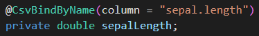
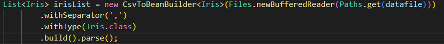

## **_Composition du groupe pour la SAÉ 3.02_**
- Nom du groupe : I2  
- Membres : BEN DHIAB Younes (IHM)  
            DA COSTA VEIGA Adrien (Analyse & implémentation du squellete du programme)  
            DEGAND Adrien (Implémentation de l'algorithme KNN & de l'algorithme de classification)
            GRONNIER Ylann (Écriture des tets & IHM)

## **_Chargement et traitement des données_**

Le chargement des données utilisées par notre application se fait par lecture de **fichier CSV** à l’aide de l’API **OpenCSV** qui nous permet de lire et de récupérer les données contenues dans un fichier CSV.
Elle permet également de grandement simplifier l’utilisation de ces dernières comme nous le verrons par la suite.  
Cela se fait dans la classe `DataSet` qui implemente l’interface `IMVCModel` qui offre notamment les méthodes `loadFomFile(String dataFile)` et `loadFronString(String data)`.   
La première permet donc d’importer les données stockées dans un fichier CSV et la seconde permettant de charger des données sous formes de chaîne de caractères reprenant le forma d’une ligne de fichier csv de la forme : `"valeur1, valeur2, valeur3, ..., valuerN"`. Ces deux méthodes sont abstraites dans la classe `DataSet`, leur comportement va se voir modifier en fonction du type de données que nous souhaitons utiliser. En effet, les caractéristiques d’un jeu de données différent d’un jeu à l’autre. Un Pokémon n’aura pas les même spécificités qu’une Iris ou qu’un(e) passager/ère du Titanic. Pour cela, il est nécessaire de créer un set de données par jeu. Ainsi, nous disposons de `PokemonDataSet`, `IrisDataSet` et `TitanicDataSet` qui permettent ainsi de pouvoir créer des objets correspondant au type de données utilisées. Le type de DataSet à utiliser **doit être sélectionné par l’utilisateur avant d’importer les données depuis l’interface graphique de l’application**. Cela permet de s’assurer que l’utilisateur souhaite utiliser un certain de type de données. 
Lorsque les données sont chargées, elles sont réparties sur les différents attributs de l’objet visé (`Pokemon`, `Iris` ou `Titanic`) de manière automatique grâce à l’instruction `@CsvBindByName(column = "nom_colonne_fichier_csv")` qui récupère donc directement la valeur contenu dans la colonne spécifiée (voir images plus bas) récupère le contenu de la colonne "sepal.length" du fichier _iris.csv_). Cela permet de faciliter la récupération des données ainsi que la création des objets nécessaire au bon fonctionnement de l'application.

Nous créons ainsi une liste de `Iris` correspondant à chaque ligne contenue dans le fichier _iris.csv_ 

En ce qui concerne la récupération de la représentation des colonnes du fichier csv chargé, nous récupérons sous forme de liste les attributs de objets Pokemon, Iris ou Titanic afin de récuperer le type de des attributs. Nous récupérons également le nom des colonnes depuis le fichier csv, car ils nous seront nécessaire plus part pour récupérer les valeurs de chaque objet Pokemon, Iris ou Titanic que nous appelerons à partir de mainenant : "points". 